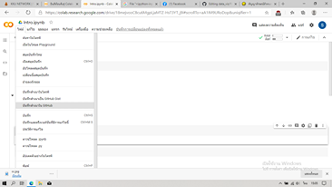
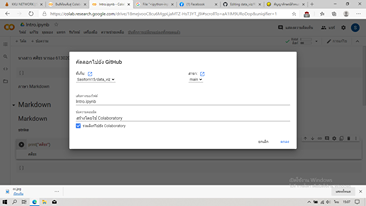
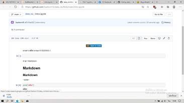

# data_viz
# ศศิธร นารอง 613020563-1

ตัวอย่างการแทรกรูปภาพ

insert img

HW1 การบันทึกไฟล์ Colab ไปยัง github
1. เปิดไฟล์งานใน "Colab" แล้วเลือกไฟล์จากนั้นกด "บันทึกสำเนาในGitHub"

2. เมื่อเลือก "บันทึกสำเนาในGithub" แล้วจะขึ้นหน้าต่างนี้ ตรงข้อความคอมมิสสามารถแก้ไขชื่อได้ หลังจากนั้นกด "ตกลง"

3. เมื่อกดตกลงแล้ว ไฟล์งานใน Colab จะแสดงใน GitHub

